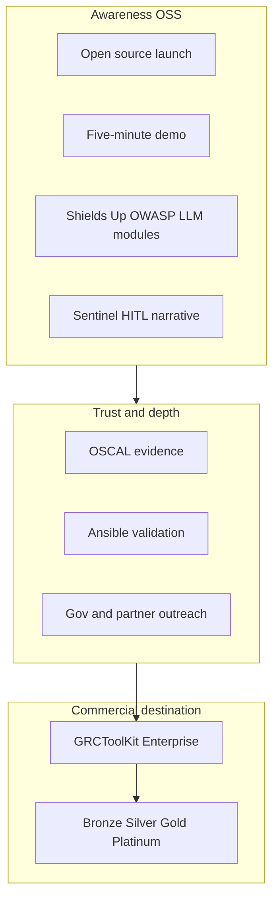

# GRCToolKit — Brand Ladder and Editions

**Last updated:** 2026-07-02  
**Maintainer:** [iFocus Innovations LLC](https://github.com/iFocus-Innovations-LLC)

---

## Brand strategy: build up to Enterprise

Branding, module names, and thought-leadership themes exist to **drive adoption and trust** toward one commercial destination: **GRCToolKit Enterprise**.

They are not separate product companies or competing brands.

| Layer | Name | Role |
|-------|------|------|
| **Product (OSS)** | GRCToolKit.ai **Community Edition** | MIT license; full self-host; BYOK for AI |
| **Module / campaign themes** | Shields Up, Sentinel/HITL, OWASP LLM probes | Showcase depth; always tie to Community self-serve or Enterprise support |
| **Commercial product** | **GRCToolKit Enterprise** | Support, training, SLAs, bundled agentic tokens, optional hosted services |

Optional future campaign language (e.g. sentinel / Phylax-style themes) must **point to GRCToolKit Enterprise** — never replace it as the product name.

---

## Community vs Enterprise (open-core boundary)

| | Community Edition | Enterprise |
|---|-------------------|------------|
| **License** | MIT | Commercial agreement (EULA + support terms) |
| **Code** | Full OSS repo — OSCAL, Ansible, AI engine, Shields Up probes | Same codebase; no proprietary fork of core compliance logic |
| **Support** | GitHub Issues, community | Bronze → Platinum SLAs |
| **Training** | Docs, demo guides | Tiered catalogs (webinar → on-site) |
| **AI / agentic usage** | BYOK (your Gemini/Anthropic keys) | BYOK + optional **bundled token pools** and usage guidance |
| **Shields Up robotics** | OSS read-only playbooks (self-serve) | Gold+ setup assist, operator training, fleet architecture review |

Enterprise adds **relationship, SLAs, training, token economics, and optional hosted agent runtime** — not a paywall on core OSCAL or Ansible in the public repo.

---

## GRCToolKit Enterprise tiers

Support and training tiers. **Pricing TBD** — see [PM-TODO.md](PM-TODO.md) P2/P3.

| Tier | Support | Training | Shields Up | Agentic tokens |
|------|---------|----------|------------|----------------|
| **Community** | GitHub / community | Documentation, conference demo guides | OSS probes only | BYOK only |
| **Bronze** | Email, best-effort SLA | Onboarding webinar | — | BYOK + usage documentation |
| **Silver** | Business-hours support | Admin + analyst training | Playbook guidance | Optional small bundled pool |
| **Gold** | Priority support, named contact | HITL + OSCAL auditor workshops | Lab setup assist | Bundled pool + overage policy |
| **Platinum** | 24/7 option, custom SLA | On-site / gov-style briefings | Fleet scan architecture review | Large pool + dedicated model routing |

### Typical conversion triggers (Community → Enterprise)

Organizations often need Enterprise when they require:

- Named support during audit or ATO preparation
- Formal training for analysts on HITL workflows and OSCAL evidence
- Predictable **agentic token** spend (bundled pools vs pure BYOK)
- Shields Up or Physical AI deployments with hands-on architecture review
- Government or enterprise procurement (EULA, invoicing, custom SLA)

---

## Module and narrative names

### Shields Up

**Shields Up** — routine security for robots and Physical AI stacks (ROS 2, OWASP LLM, RSF).  
Part of the **path to GRCToolKit Enterprise**. See [SHIELDS-UP-ROBOTICS.md](SHIELDS-UP-ROBOTICS.md).

### Sentinel / HITL

**Sentinel** language describes guardian-style AI guardrails — human approval before remediation. Documented in [HITL-FRAMEWORK.md](HITL-FRAMEWORK.md) and [ai-agent/openclaw/SOUL.md](../ai-agent/openclaw/SOUL.md). Builds trust toward Enterprise training on HITL tiers.

### OWASP LLM probes

`ansible/playbooks/llm/` — read-only checks aligned with [OWASP GenAI / LLM Top 10](https://genai.owasp.org/llm-top-10/). Community self-serve; Enterprise adds interpretation workshops and token-metered AI triage at scale.

---

## Agentic token economics (overview)

Agentic workflows consume **input/output tokens** (scenario analysis, AI PR review, Shields Up triage, OpenClaw-style agents).

| Model | Description |
|-------|-------------|
| **BYOK** | Community and all tiers — customer supplies Gemini, Anthropic, or Vertex keys |
| **Bundled pools** | Enterprise Silver+ — prepaid token allocation per month |
| **Overage** | Gold+ — documented pass-through or margin policy (macro-sensitive) |
| **Audit** | All tiers — HITL audit trail should record model ID, approximate tokens, approver (future product work; see PM-TODO P3) |

Detailed metering and pricing: [PM-TODO.md](PM-TODO.md) § P3.

---

## Public voice

> Legacy GRC tools excel at governance workflows. **GRCToolKit.ai** is open source infrastructure for automated NIST validation and OSCAL evidence — with a clear path to **GRCToolKit Enterprise** for support, training, and agentic compliance at scale.

See also [OVERVIEW.md](OVERVIEW.md#why-grctoolkit-vs-traditional-grc) and [ROADMAP.md](ROADMAP.md#market-positioning-grctoolkit-vs-traditional-grc).

---

## Related documents

- [OVERVIEW.md](OVERVIEW.md) — Executive overview
- [ROADMAP.md](ROADMAP.md) — Technical and commercial roadmap
- [PM-TODO.md](PM-TODO.md) — P2 Enterprise, P3 tokens, P4 macro watchlist
- [LICENSE](../LICENSE) — MIT (Community Edition software)
