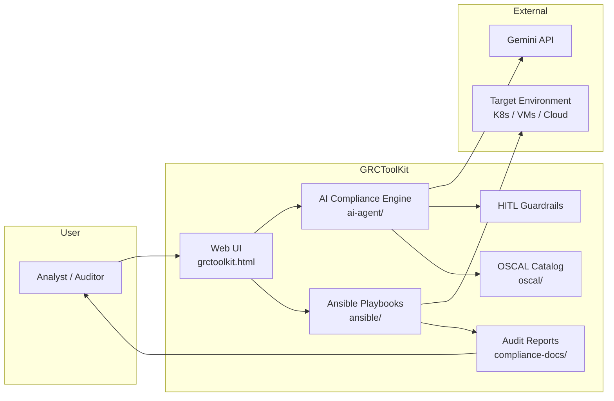

# GRCToolKit.ai — Project Overview

**Version:** 2.1.0-dev  
**Status:** Development / QA Ready  
**License:** MIT  
**Repository:** [github.com/iFocus-Innovations-LLC/GRCToolKit](https://github.com/iFocus-Innovations-LLC/GRCToolKit)  
**Maintainer:** [iFocus Innovations LLC](https://github.com/iFocus-Innovations-LLC)

---

## Executive summary

**GRCToolKit.ai** is an open source Governance, Risk, and Compliance (GRC) platform that helps security and compliance teams move from natural-language scenarios to **actionable NIST SP 800-53 Rev. 5 controls**, **automated validation**, and **OSCAL-compliant audit evidence** — with **Human-in-the-Loop (HITL)** guardrails so AI recommendations never bypass human approval for remediation.

The project is designed for organizations modernizing compliance workflows in cloud and Kubernetes environments, including teams planning **post-quantum cryptography (PQC)** migration aligned with **NIST FIPS 203 / 204 / 205**.

> **Try it in five minutes:** clone the repo, set `GEMINI_API_KEY`, run `./scripts/run-local.sh`, open `http://127.0.0.1:8080/local-index.html`, and analyze a GRC scenario.

---

## Why GRCToolKit vs traditional GRC

Legacy GRC suites (e.g. enterprise IRM/GRC platforms and compliance SaaS) excel at **workflow, attestations, and document storage**. They are weaker at **technical control validation**, **machine-readable audit evidence**, and **engineer-operable automation**.

GRCToolKit.ai targets that gap:

| Capability | Typical GRC application | GRCToolKit.ai |
|------------|-------------------------|---------------|
| NIST 800-53 + OSCAL | Manual mapping or add-on modules | Native OSCAL catalog and assessment artifacts |
| Prove a control works | Policy sign-off, screenshots | Ansible read-only probes + JSON evidence |
| AI in compliance | Generic chat over policies | Scenario → controls with **HITL** and confidence tiers |
| Post-quantum readiness | Rarely addressed | FIPS 203/204/205 playbooks and migration roadmap |
| Inspectability | Closed SaaS | **MIT open source** — run, fork, audit the code |
| Physical AI / robotics | Not in scope | **Shields Up** roadmap: OWASP LLM, RSF, robotic stacks |
| Deployment | Vendor cloud only | Docker, Kubernetes, Helm, GCP bootstrap |

**Fair positioning:** GRCToolKit is not a replacement for full enterprise GRC operations (multi-tenant RBAC, vendor risk suites, FedRAMP-authorized SaaS). It is open source **infrastructure for automated NIST validation, OSCAL evidence, and HITL-guarded AI** — built for security engineers, auditors, and innovation programs that need controls **validated in the stack**, not only tracked in a dashboard.

Three market forces align with this approach: **OSCAL** adoption for machine-readable assessments, **PQC** migration mandates ([DoW 2030 support / 2031 use](ROADMAP.md#dow-pqc-strategy-alignment) + CNSA 2.0 for NSS; optional NIST 2030/2035 civilian track), and **Physical AI** systems that require security and compliance in the same pipeline.

For roadmap detail, see [ROADMAP.md](ROADMAP.md#market-positioning-grctoolkit-vs-traditional-grc).

---

## Problem we solve

| Challenge | How GRCToolKit addresses it |
|-----------|------------------------------|
| Compliance mapping is slow and manual | AI maps scenarios to NIST 800-53 R5 controls with structured JSON output |
| Evidence is inconsistent across audits | OSCAL catalog + automated assessment artifacts |
| Control validation is hard to operationalize | Ansible playbooks for AC, AU, SC, and PQC controls |
| AI in GRC creates trust and liability risk | HITL tiers, confidence scoring, audit trails — no silent auto-remediation |
| Quantum risk is an emerging mandate | PQC asset inventory, migration phases, and deployment playbooks |

---

## Core capabilities

### AI compliance engine
- Natural-language GRC scenario analysis
- Gemini API integration (`generateContent`, structured JSON)
- Control recommendations with implementation guidance

### OSCAL & automation
- NIST 800-53 Rev. 5 OSCAL catalog (`oscal/catalog/`)
- Ansible playbooks for control validation and evidence collection
- **Production handoff:** [Ansible Audit Operations](ANSIBLE-AUDIT-OPERATIONS.md) (ITIL window, manual CLI, SysAdmin RACI)
- Auditor-ready report generation (`compliance-docs/`)

### Human-in-the-Loop (HITL)
- Three-tier model: **Automated → Human Review → Human-Guided**
- Confidence thresholds trigger human review before high-impact actions
- Documented sentinel architecture and policy anchors  
  → [HITL Framework](HITL-FRAMEWORK.md)
- **Scheduled / agentic workflows** (future): assessment and triage may run on a throttle-controlled schedule via [Google ADK](https://adk.dev/); remediation still requires HITL, and GCP QA must enforce token budgets before enabling schedulers  
  → [Agentic GRC runtime (ADK) + token throttling](ROADMAP.md#agentic-grc-runtime-adk--token-throttling)

### Post-quantum cryptography (PQC)
- Cryptographic asset inventory and quantum risk scoring
- Four-phase migration roadmap (Preparation → Baseline → Execution → Monitoring)
- Multi-mandate timelines: DoW 2030/2031 + CNSA 2.0 awareness; optional NIST 2030/2035 civilian track  
  → [DoW PQC Strategy alignment](ROADMAP.md#dow-pqc-strategy-alignment)
- Ansible automation for ML-KEM, ML-DSA, and SLH-DSA (FIPS 203/204/205)  
  → [PQC Integration Summary](PQC-INTEGRATION-SUMMARY.md)

### Cloud-native deployment
- Hardened Docker images (non-root, security headers, graceful shutdown)
- Kubernetes manifests, Helm chart (`charts/grc-toolkit/`), GCP Terraform bootstrap
- Secrets via environment variables, Kubernetes Secrets, or GCP Secret Manager — **no hardcoded keys**  
  → [Secrets Setup](SECRETS-SETUP.md) · [Helm & Terraform](HELM-TERRAFORM.md)

### Open source governance
- MIT license, contributing guide, code of conduct, CODEOWNERS
- CI: container hardening, image pin checks, MVP demo tests, AI peer review on PRs
- Security policy and private vulnerability reporting path  
  → [SECURITY.md](SECURITY.md) · [CONTRIBUTING.md](../CONTRIBUTING.md)

---

## Architecture (high level)

**Typical workflow**

1. Analyst describes a compliance scenario in plain language.
2. AI engine recommends NIST 800-53 controls (with confidence scoring).
3. Analyst reviews recommendations (HITL gate for medium/high risk).
4. **Validate Controls** runs Ansible playbooks against localhost (lab) or **manual Ansible** per [ANSIBLE-AUDIT-OPERATIONS.md](ANSIBLE-AUDIT-OPERATIONS.md) for production targets.
5. **Generate Audit Report** produces OSCAL-aligned documentation.

---

## Standards & framework alignment

| Standard / framework | Role in GRCToolKit |
|----------------------|-------------------|
| **NIST SP 800-53 Rev. 5** | Primary control catalog |
| **OSCAL 1.0.0** | Machine-readable catalogs, assessments, and results |
| **NIST CSF 2.0** | Mapping context for AI recommendations (roadmap expansion) |
| **NIST FIPS 203 / 204 / 205** | PQC algorithms (ML-KEM, ML-DSA, SLH-DSA) |
| **DoW PQC Strategy / CNSA 2.0** | Federal deadline model (2030 support / 2031 use) and NSS algorithm-suite awareness — see [ROADMAP DoW alignment](ROADMAP.md#dow-pqc-strategy-alignment) |
| **Zero-trust principles** | Least privilege, secrets management, audit logging |

---

## Deployment options

| Environment | Path | Best for |
|-------------|------|----------|
| **Local (fastest)** | `./scripts/run-local.sh` | Developers, demos, conference dry-runs |
| **Docker** | `docker build` + `docker run` | Single-node testing |
| **GKE / Kubernetes** | Helm chart or `scripts/deploy.sh` | QA and production-style environments |
| **GCP bootstrap** | `terraform/gcp-bootstrap` + Secret Manager | Org-owned dev/QA projects |

Full procedures: [Deployment Guide](DEPLOYMENT.md) · [GCP Deployment Checklist](GCP-DEPLOYMENT-CHECKLIST.md) · [Conference Demo Guide](CONFERENCE-DEMO-GUIDE.md)

---

## Who this is for

- **GRC analysts and auditors** — faster control mapping and evidence packaging
- **Security engineers** — operationalize NIST controls with Ansible
- **Platform / DevSecOps teams** — deploy on GKE with hardened containers and CI gates
- **Research & innovation programs** — open, inspectable compliance automation with HITL safety rails
- **PQC migration leads** — inventory, multi-mandate timeline (DoW 2030/2031 + CNSA awareness), and HITL-gated deployment evidence for Commercial Solutions track

---

## Open source & community

GRCToolKit.ai is **open source under the MIT license**. We welcome:

- Bug reports and feature requests (GitHub Issues)
- Documentation improvements and demo scenarios
- Contributions to OSCAL mappings, Ansible playbooks, and PQC modules

See [CONTRIBUTING.md](../CONTRIBUTING.md) and [CODE_OF_CONDUCT.md](../CODE_OF_CONDUCT.md).

**Roadmap:** [ROADMAP.md](ROADMAP.md)

---

## What we are — and what we are not (today)

| ✅ Today | ⏳ Not claimed yet |
|----------|-------------------|
| Open source GRC toolkit with NIST/OSCAL foundation | FedRAMP or IL authorization |
| HITL-guarded AI recommendations | Fully autonomous remediation |
| Dev/QA-ready container and K8s deployment | Managed SaaS offering |
| PQC migration tooling and playbooks | Complete CSF 2.0 database integration |
| Documented security and secrets practices | Formal third-party security certification |

We are transparent about maturity so evaluators — including government innovation programs and startup partners — can assess fit accurately.

---

## Engage with the project

| Goal | Action |
|------|--------|
| **Evaluate the platform** | Clone repo → [Quick Start](../README.md#-quick-start) |
| **Run a live demo** | [Conference Demo Guide](CONFERENCE-DEMO-GUIDE.md) |
| **Deploy on GCP** | [GCP Demo Guide](GCP-DEMO-GUIDE.md) |
| **Report a security issue** | [SECURITY.md](SECURITY.md) (private reporting — do not file public issues) |
| **Contribute code or docs** | [CONTRIBUTING.md](../CONTRIBUTING.md) |
| **Partnership / pilot inquiry** | Open a GitHub Discussion or contact maintainers via the repository |

---

## Technology stack (at a glance)

| Layer | Technology |
|-------|------------|
| UI | HTML5, Tailwind CSS, JavaScript |
| AI | Google Gemini API (`gemini-2.5-flash`, structured JSON) |
| Compliance data | NIST 800-53 R5 OSCAL catalog |
| Automation | Ansible |
| Runtime | Docker, nginx (non-root) |
| Orchestration | Kubernetes, Helm |
| IaC | Terraform (GCP bootstrap) |
| CI/CD | GitHub Actions (build, scan, AI PR review) |
| Secrets | GCP Secret Manager, K8s Secrets, WIF for Actions |

---

## Related documentation

- [README](../README.md) — full project entry point
- [OSCAL Integration](OSCAL-INTEGRATION.md)
- [HITL Framework](HITL-FRAMEWORK.md)
- [PQC Integration Summary](PQC-INTEGRATION-SUMMARY.md)
- [Zero-Trust Agentic AI](../ai-agent/openclaw/SOUL.md) — future autonomous auditor direction
- [Branch Protection](BRANCH-PROTECTION.md) — merge gates and CI requirements
- [Changelog](CHANGELOG.md)

---

*Last updated: 2026-07-16 · GRCToolKit.ai v2.1.0-dev*
