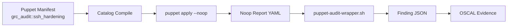

# Puppet Audit Engine — Read-Only NIST Validation

**Status:** Proof of Concept (POC)  
**Integration:** Parallel to Ansible grc-audit playbooks  
**Mode:** `puppet apply --noop` (no state changes)  
**License:** Open-source Puppet 7/8 or OpenVox community fork  
**HITL:** Evidence collection only; no remediation without human approval

---

## Overview

GRCToolKit adds **Puppet** as a second read-only audit engine alongside Ansible in a **proof-of-concept implementation**. Puppet's declarative model and `--noop` mode provide drift detection and compliance validation without changing system state.

### Why Puppet + Ansible?

| Dimension | Ansible | Puppet |
|-----------|---------|--------|
| **Model** | Imperative (tasks) | Declarative (desired state) |
| **Drift detection** | Manual checks in tasks | Built-in via catalog comparison |
| **Agent mode** | Agentless (SSH) | Agent or agentless (`puppet apply`) |
| **Strengths** | Procedural validation, orchestration | State drift, idempotent resources |
| **GRCToolKit use** | Multi-control suites (AC/AU/SC/LLM) | Single-control drift checks (SSH, file perms, packages) |

**Complementary, not redundant:** Ansible excels at multi-step validation workflows; Puppet excels at "is this file/service/package in the correct state?" checks. This POC validates the approach with a single module.

---

## Architecture

### Ansible-Driven Execution (Experimental)

**Status: EXPERIMENTAL - POC Stage**

Puppet runs as an optional check driven by the existing Ansible runner:
- **No sidecar, DaemonSet, or new container**
- **No changes to k8s/Helm**
- Small read-only Ansible playbook (`ansible/playbooks/puppet-audit.yml`):
  1. Checks if Puppet/OpenVox installed on target (reports SKIP if not, **never installs**)
  2. Copies `puppet/modules/grc_audit` to target temp directory
  3. Runs `puppet apply --noop` with per-run temp `--vardir`
  4. Fetches `last_run_report.yaml` back to controller
  5. Feeds report to `scripts/parse-puppet-summary.py` locally
  6. Exports to OSCAL via `scripts/puppet-to-oscal.py`

**Usage:**
```bash
ansible-playbook ansible/playbooks/puppet-audit.yml \
  -i inventory.ini \
  -e "puppet_module=grc_audit::ssh_hardening" \
  -e "control_id=IA-2" \
  -e "oscal_output=/tmp/grc-oscal-reports"
```

### Read-Only Model



**Flow:**
1. Puppet manifest declares desired state (e.g., `sshd_config` setting)
2. `puppet apply --noop` compiles catalog and simulates changes
3. Noop report shows drift (would-be changes) without applying
4. Wrapper parses report → PASS/WARN/FAIL finding
5. Finding maps to NIST control (IA-2, AC-3, CM-6, etc.)
6. OSCAL export reuses existing GRCToolKit patterns

### HITL Guardrails

- **Never run without `--noop`**: Wrapper enforces noop flag; exit if missing
- **AU-2 audit trail**: Log all runs with manifest name, hostname, timestamp
- **HITL approval required**: Any suggested remediation (puppet apply without --noop) requires documented human approval

---

## Directory Layout

```
puppet/
├── modules/
│   └── grc_audit/
│       ├── manifests/
│       │   ├── init.pp                 # Module entry point
│       │   ├── ssh_hardening.pp        # IA-2/AC-3: SSH config checks
│       │   ├── file_permissions.pp     # AC-6: World-writable file checks
│       │   └── package_baseline.pp     # CM-7: Installed package inventory
│       ├── files/                      # Static config templates (optional)
│       ├── templates/                  # ERB templates (optional)
│       └── README.md                   # Module usage
├── manifests/
│   ├── site.pp                         # Top-level manifest (optional)
│   └── nodes/                          # Node-specific manifests (optional)
├── reports/                            # Noop report output (gitignored)
└── puppet.conf                         # Minimal config (no master)

scripts/
├── puppet-audit-wrapper.sh             # Parse noop report → JSON finding
└── run-puppet-audit.sh                 # Orchestrate puppet apply --noop
```

**Module conventions:**
- Prefix: `grc_audit::` (e.g., `grc_audit::ssh_hardening`)
- Parameters: `ensure_compliance => false` (read-only by default)
- Noop-only: Wrapper blocks applies without `--noop`

---

## Noop Report → Finding Mapping

### Puppet Noop Report Structure

```yaml
# Example: puppet/reports/localhost-1696118400.yaml
host: localhost
time: "2026-09-30T15:30:00.000Z"
logs:
  - level: notice
    message: "/Stage[main]/Grc_audit::Ssh_hardening/File[/etc/ssh/sshd_config]/content: current_value {md5}abc123, should be {md5}def456 (noop)"
    source: "Puppet"
metrics:
  resources:
    total: 5
    out_of_sync: 1
status: changed
```

### Wrapper Logic

```bash
# scripts/puppet-audit-wrapper.sh
if grep -q "out_of_sync: 0" report.yaml; then
  STATUS="PASS"
  MESSAGE="All resources in desired state"
elif grep -q "out_of_sync:" report.yaml; then
  STATUS="WARN"  # or FAIL based on severity
  MESSAGE="Drift detected: N resources out of sync"
else
  STATUS="SKIP"
  MESSAGE="Could not parse noop report"
fi
```

**Finding JSON:**
```json
{
  "control": "IA-2",
  "status": "WARN",
  "message": "SSH PasswordAuthentication enabled (should be 'no' per NIST 800-53)",
  "evidence": "/etc/ssh/sshd_config line 42: PasswordAuthentication yes (drift detected)"
}
```

---

## Control Mapping

| Puppet Module | NIST 800-53 Controls | Check |
|---------------|----------------------|-------|
| `grc_audit::ssh_hardening` | **IA-2**, AC-3, AC-17 | SSH PasswordAuthentication, PermitRootLogin, PubkeyAuthentication |
| `grc_audit::file_permissions` | **AC-6**, AC-3 | World-writable files in /etc, /var, /home |
| `grc_audit::package_baseline` | **CM-7**, SI-2 | Unexpected packages, missing security updates |
| `grc_audit::audit_daemon` | **AU-2**, AU-3, AU-12 | auditd running, rules loaded |

**Bold** = MVP POC target (IA-2 via SSH hardening).

---

## Runner API Integration

### Option 1: Extend `ansible-runner-api.py` (Recommended)

Add `/run-puppet` endpoint parallel to `/run`:

```python
# scripts/ansible-runner-api.py
PUPPET_MODULES = {
    "ssh_hardening": "grc_audit::ssh_hardening",
    "file_permissions": "grc_audit::file_permissions",
}

@POST /run-puppet
def run_puppet():
    module = request.json.get("module")  # e.g., "ssh_hardening"
    if module not in PUPPET_MODULES:
        return {"error": "Unknown module"}, 400
    
    # Run wrapper (enforces --noop)
    result = subprocess.run([
        "./scripts/run-puppet-audit.sh",
        PUPPET_MODULES[module]
    ], capture_output=True, timeout=60)
    
    # Parse JSON finding from wrapper
    finding = json.loads(result.stdout)
    return {"findings": [finding]}
```

### Option 2: Standalone Script (MVP)

```bash
# scripts/run-puppet-audit.sh ssh_hardening
./scripts/puppet-audit-wrapper.sh grc_audit::ssh_hardening > /tmp/grc-puppet-finding.json
```

**MVP POC uses Option 2** (standalone). Option 1 for future integration.

---

## Licensing & Distribution

### Open-Source Puppet Landscape (2026)

| Puppet Variant | License | Status | GRCToolKit Use |
|----------------|---------|--------|----------------|
| **Puppet 7/8 (Perforce)** | Apache 2.0 (open-source agent, `puppet apply`) | Active | ✅ Primary target |
| **OpenVox** | Community fork (post-Perforce acquisition) | Active (hypothetical 2026) | ✅ Compatible |
| **Puppet Enterprise** | Commercial (licensed) | Active | ❌ Not used (no PE features) |
| **Puppet Comply** | Commercial compliance module | Active | ❌ Not used (DIY manifests) |

**GRCToolKit position:**
- Use only open-source Puppet DSL (manifests, modules, `puppet apply`)
- No Puppet Enterprise Console, orchestrator, or licensed modules
- Compatible with Puppet 7+ or OpenVox community builds
- `puppet apply` agentless mode (no master/agent PKI)

**Community notes:**
- Puppet open-source remains Apache 2.0 as of 2026
- Perforce (acquired Puppet 2022) maintains open-source agent
- OpenVox hypothetical fork mirrors community concerns (similar to Chef → Cinc)
- GRCToolKit manifests work on any Puppet 7+ distribution

---

## Phased Implementation Plan

### Phase 0: POC (Current — Demonstrates Viability)

- [x] Design doc (this file)
- [x] One module: `grc_audit::ssh_hardening` (IA-2)
- [x] Wrapper: `puppet-audit-wrapper.sh` (noop report → JSON)
- [x] OSCAL converter: `puppet-to-oscal.py` (JSON finding → OSCAL result)
- [x] Smoke test: local `puppet apply --noop`
- [ ] CI: optional `puppet parser validate` (if Puppet installed)

**Success criteria:** Single control check (SSH PasswordAuthentication) runs in noop mode, produces PASS/WARN finding, doesn't change system, and can export to OSCAL format. **Status:** ✅ POC demonstrates technical viability.

### Phase 1: Expand Validation Coverage (Post-POC Approval)

- [ ] Add 3-5 modules: file_permissions (AC-6), package_baseline (CM-7), audit_daemon (AU-2)
- [ ] Runner API `/run-puppet` endpoint
- [ ] OSCAL export integration (reuse Ansible patterns)
- [ ] Docs: PUPPET-AUDIT-OPERATIONS.md (parallel to Ansible ops guide)

### Phase 2: Multi-Node Support

- [ ] Agent mode support (optional; authenticated agents)
- [ ] Hiera data for node-specific baselines
- [ ] Fleet summary reports (multiple nodes)

### Phase 3: Windows Support

- [ ] Windows-specific modules (Registry, file ACLs)
- [ ] Align with PM-TODO P4 (Windows Ansible + Chocolatey track)

---

## Development Guidelines

### Manifest Style

```puppet
# puppet/modules/grc_audit/manifests/ssh_hardening.pp
class grc_audit::ssh_hardening (
  Boolean $ensure_compliance = false,  # false = audit-only (noop)
  String $sshd_config_path = '/etc/ssh/sshd_config',
) {
  # Read-only by default; never apply unless HITL approved
  if $ensure_compliance {
    notify { 'grc_audit_hitl_required':
      message => 'HITL: ensure_compliance=true requires documented human approval (AU-2)',
    }
  }

  file { $sshd_config_path:
    ensure  => file,
    content => template('grc_audit/sshd_config.erb'),
    # In noop mode, this just reports drift
  }

  # Specific setting checks
  file_line { 'ssh_password_auth':
    path  => $sshd_config_path,
    line  => 'PasswordAuthentication no',
    match => '^#?PasswordAuthentication',
  }
}
```

### Testing

```bash
# Syntax validation
puppet parser validate puppet/modules/grc_audit/manifests/*.pp

# Lint
puppet-lint --no-autoloader_layout-check puppet/modules/grc_audit/

# Noop run (local)
puppet apply --noop --modulepath=./puppet/modules -e 'include grc_audit::ssh_hardening'

# Wrapper smoke
./scripts/puppet-audit-wrapper.sh grc_audit::ssh_hardening
```

---

## Integration with Existing GRCToolKit

### OSCAL Export

Reuse `compliance-docs/` patterns:

```python
# scripts/oscal_pdf.py (extend)
def puppet_finding_to_oscal(finding):
    return {
        "control-id": finding["control"],
        "status": finding["status"].lower(),
        "remarks": finding["message"],
        "evidence": finding["evidence"],
    }
```

### UI Integration

Add "Engine" dropdown: **Ansible** | **Puppet**

- Ansible: Existing multi-control suites
- Puppet: Single-control drift checks

### Report Consolidation

```json
{
  "framework": "NIST 800-53 Rev. 5",
  "engines": {
    "ansible": { "controls_validated": 12, "findings": [...] },
    "puppet": { "controls_validated": 3, "findings": [...] }
  },
  "overall_status": "WARN"
}
```

---

## Open Questions & Future Work

1. **Ingest existing Puppet reports (Post-Gate):** Query PuppetDB or read node report files from existing Puppet infrastructure instead of running our own noop checks
2. **Agent vs Agentless:** POC uses `puppet apply` (agentless). Do we need agent mode for fleet scale?
3. **Hiera integration:** Use Hiera for environment-specific baselines (dev vs prod SSH settings)?
4. **Custom facts:** Do we need custom Facter facts for GRC metadata (e.g., `$::compliance_tier`)?
5. **Windows priority:** Windows Registry/ACL checks in Phase 3, or sooner to align with Chocolatey track?
6. **Catalog compilation time:** Large manifests may be slow; cache catalogs or pre-compile?

---

## References

- [Puppet Open Source](https://www.puppet.com/docs/puppet/8/puppet_index.html)
- [Puppet Apply (Agentless)](https://www.puppet.com/docs/puppet/8/man/apply.html)
- [Puppet Noop Mode](https://www.puppet.com/docs/puppet/8/configuration.html#noop)
- [OpenVox Community Fork](https://github.com/voxpupuli) (Vox Pupuli community modules)
- NIST 800-53 Rev. 5: IA-2, AC-3, AC-6, AU-2, CM-6, CM-7

---

**Last Updated:** 2026-09-30  
**Version:** 0.1 (POC)  
**Tracker:** Branch `cursor/puppet-audit-engine-a598`
