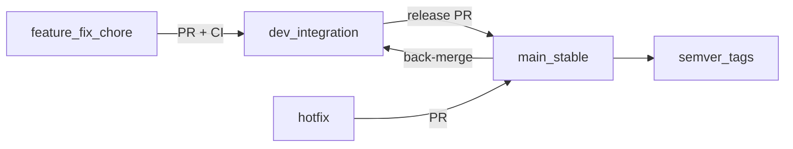

# Release and Branching Strategy — GRCToolKit.ai

**Last updated:** 2026-07-30  
**Related:** [BRANCH-PROTECTION.md](BRANCH-PROTECTION.md) · [CONTRIBUTING.md](../CONTRIBUTING.md)

Industry-standard **GitHub Flow with an integration branch**: short-lived topic branches, protected `main`, integration on `dev`, immutable release/demo tags.

---

## Branch roles

| Ref | Role |
|-----|------|
| `main` | Stable / releasable. PR-only. Protected. |
| `dev` | Integration branch for ongoing work. |
| `feature/*`, `fix/*`, `chore/*`, `docs/*` | Short-lived topic branches. |
| `hotfix/*` | Urgent fixes branched from `main`. |
| `vX.Y.Z` / `vX.Y.Z-qa-demo` | Immutable release or QA/Demo pins. |



### Typical flow

```bash
git checkout dev && git pull origin dev
git checkout -b feature/your-change
# ... work, push ...
# Open PR → dev
# When ready to release: PR dev → main, then tag
```

**Maintainer exception:** docs/hotfix PRs may target `main` directly during freeze periods, with CODEOWNERS review.

---

## QA / Demo freeze

Demos and GCP QA must **not** track a moving tip of `main`.

| Pin | Purpose |
|-----|---------|
| `v2.1.0-qa-demo` | Current frozen QA/Demo release (created after MVP CI cleanup lands on `main`) |

**Rules:**

1. Conference / local / GCP demos checkout the freeze tag (or image tag `2.1.0-qa-demo`).
2. Feature work continues on `dev` / `feature/*` — do not move the freeze tag.
3. Demo-critical hotfixes: `hotfix/*` → `main` → new tag `v2.1.x-qa-demo` (patch bump).
4. Historical tags (`v2.0.0-dev`, `v2.1.0-dev`) remain for archaeology only.

```bash
git fetch --tags
git checkout v2.1.0-qa-demo
export GEMINI_API_KEY="your-key"
./scripts/run-local.sh
```

See [CONFERENCE-DEMO-GUIDE.md](CONFERENCE-DEMO-GUIDE.md).

---

## CI gates (MVP)

| Check | Required |
|-------|----------|
| Human CODEOWNERS review | Yes |
| `test` / PR test workflows (hardening, image pins, Trivy, MVP scripts) | Yes |
| Anthropic / Claude AI peer-review workflow | **No** — removed from MVP to avoid second-LLM token spend |

Optional multi-model CI review is deferred to roadmap GenAI research (PM-TODO P6).

---

## Stale branch hygiene

1. Prefer delete remotes after PR merge (`git push origin --delete <branch>`).
2. Only delete branches **verified** as ancestors of `main` (or explicitly abandoned).
3. Keep long-lived: `main`, `dev`, and intentional planning branches (e.g. `feature/shields-up-robotics` until production gate).

---

## Alignment notes

- Secure development practices align toward [CISA Open Source Software: Security Principles and Practices](https://www.cisa.gov/resources-tools/resources/open-source-software-security-principles-and-practices) — see [SECURITY.md](SECURITY.md).
- In-product AI remains **Gemini BYOK** only for the QA-ready MVP.
