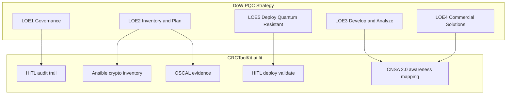
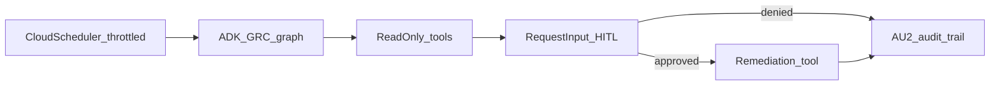

# 🚀 GRCToolKit Development Roadmap

## Executive Summary

GRCToolKit is evolving as open-source **infrastructure for automated NIST validation, OSCAL evidence, and HITL-guarded PQC workflows**, building on its existing NIST 800-53 R5 and OSCAL foundation. This roadmap outlines strategic enhancements and PQC integration — including DoW Commercial Solutions track alignment and multi-mandate deadline tracking — without claiming a completed enterprise migration platform.

**Market thesis:** Most GRC applications optimize for governance workflows and attestations. GRCToolKit optimizes for **automated control validation**, **OSCAL-native evidence**, and **HITL-guarded AI** in environments engineers actually run — cloud, Kubernetes, and (post-production) Physical AI / robotics. See [Market positioning](#market-positioning-grctoolkit-vs-traditional-grc) and the [Executive Overview](OVERVIEW.md#why-grctoolkit-vs-traditional-grc).

---

## Market positioning: GRCToolKit vs traditional GRC

### Where GRCToolKit differentiates

| Dimension | Traditional GRC suite | GRCToolKit direction |
|-----------|----------------------|----------------------|
| Primary user | GRC analyst, audit PM | Security engineer, auditor, platform team |
| Control evidence | Documents, tickets, manual attestation | OSCAL artifacts + Ansible probe output |
| NIST 800-53 | Reference libraries, manual mapping | AI scenario mapping + catalog integration |
| Automation | Limited or proprietary | Open Ansible playbooks (AC/AU/SC, PQC, OWASP LLM) |
| AI role | Policy chat, generic assistants | Structured control recommendations with **HITL** gates |
| PQC migration | Emerging slide-deck topic | Inventory, OSCAL evidence, FIPS 203/204/205 + DoW Commercial Solutions alignment |
| Deployment model | Vendor-hosted SaaS | Open source; self-hosted Docker/GKE/Helm |
| Physical AI / robots | Out of scope | **Shields Up** (Phase 4+): RSF, OWASP LLM, routine read-only scans |

### What we are not claiming (today)

- Replacement for enterprise GRC workflow suites (Archer-class IRM, broad risk registers, vendor management)
- FedRAMP- or IL-authorized managed service
- Fully autonomous remediation (HITL is required by design)
- Complete CSF 2.0 database or multi-tenant SaaS at launch
- NSA Type 1 / High Assurance ECU (HA-ECU) certification, NSA Key Management Infrastructure (KMI), or DoW CIO pre-deployment approval authority

### Strategic narrative (for partners and evaluators)

> Legacy GRC tools excel at governance workflows. **GRCToolKit.ai** is open source infrastructure for **automated NIST 800-53 validation**, **OSCAL evidence**, and **HITL-guarded AI** — with a roadmap into PQC (aligned to the [DoW PQC Strategy](#dow-pqc-strategy-alignment) Commercial Solutions track) and robotic / Physical AI security. We give engineers and auditors something they can **run, inspect, and extend**.

### Roadmap alignment

| Phase | Focus | Market message |
|-------|--------|----------------|
| **Now — production gate** | OSCAL, Ansible, HITL, PQC core, GCP deploy | Prove the automatable GRC stack |
| **PQC — DoW LOE 2/5** | Inventory, OSCAL evidence, HITL-gated commercial validation | Align with DoW Commercial Solutions track |
| **Phase 4+ — Shields Up** | Robotics, OWASP LLM, RSF | Extend validation to Physical AI |
| **Future — ADK agents** | Scheduled HITL-gated triage + token throttle | Autonomous assessment without GCP overcharge |
| **Future — sim / ovrtx** | Synthetic lab, sensor evidence (post v0.1) | Demo and train without production robot risk |

---

## Current Strengths & Foundation

### ✅ v1.1 OSCAL Integration Features (Confirmed)
- **OSCAL Compliance**: Full NIST 800-53 R5 OSCAL catalog integration
- **AI Compliance Engine**: Automated assessment and control mapping
- **Ansible Automation**: Automated compliance control implementation
- **Auditor Reports**: Automated compliance documentation generation
- **Enterprise Security**: Enhanced security documentation and best practices

### ✅ Production-Ready Deployment Features
- **Containerized**: Docker-based deployment with nginx
- **Kubernetes Ready**: Complete K8s manifests for GCP deployment
- **CI/CD Pipeline**: Automated testing and deployment with GitHub Actions
- **Auto-scaling**: Horizontal Pod Autoscaler for dynamic scaling
- **Security**: Non-root containers, security headers, vulnerability scanning
- **Monitoring**: Health checks, logging, and observability features

### ✅ Technology Stack
- **Frontend**: HTML, Tailwind CSS
- **AI Model**: Gemini 2.0 Flash
- **Automation**: Ansible playbooks
- **Deployment**: Docker, Kubernetes (GCP)
- **CI/CD**: GitHub Actions
- **Standards**: NIST 800-53 R5, OSCAL format

---

## Planned Enhancements (Core Platform)

### 1. Refine AI Prompting
- **Objective**: More detailed prompts for precise responses
- **Features**:
  - Enhanced prompt templates with CSF 2.0 mappings
  - Context-aware scenario analysis
  - Multi-turn conversation support
  - Domain-specific knowledge injection

### 2. Structured Output with JSON Schema
- **Objective**: Consistent, parseable AI responses
- **Features**:
  - JSON schema validation for AI responses
  - Control ID, name, explanation structure
  - CSF 2.0 mapping integration
  - Error handling and fallback mechanisms

### 3. Actual GRC Data Integration
- **Objective**: Database-backed control mapping
- **Features**:
  - Firestore integration for NIST 800-53 data
  - CSF 2.0 database schema
  - Real-time control catalog updates
  - Offline capability with local caching

### 4. User Authentication & Data Persistence
- **Objective**: Multi-user support with data persistence
- **Features**:
  - Firebase Authentication integration
  - Firestore for user queries and reports
  - User preferences and saved scenarios
  - Audit trail for compliance activities

### 5. Advanced UI Features
- **Objective**: Enhanced user experience
- **Features**:
  - Advanced filtering and sorting
  - Control implementation tracking
  - Direct links to NIST documentation
  - Interactive compliance dashboards
  - Real-time collaboration features

### 6. Backend AI Logic
- **Objective**: Sophisticated AI capabilities
- **Features**:
  - Fine-tuned models for GRC scenarios
  - Knowledge graph integration
  - Integration with other GRC tools
  - Custom model training capabilities
  - **Hosted multi-step agents** via [ADK](https://adk.dev/) (see [Agentic GRC runtime](#agentic-grc-runtime-adk--token-throttling))

### 7. Integration with Other GRC Tools
- **Objective**: Ecosystem connectivity
- **Features**:
  - RESTful APIs for external integrations
  - Webhook support for event notifications
  - Import/export capabilities
  - Third-party tool connectors

---

## PQC Migration Integration Strategy

### Alignment with PQC Migration Framework

GRCToolKit's existing capabilities provide an ideal foundation for PQC migration:

- ✅ **NIST 800-53 Integration**: Foundation for PQC controls (SC-12, SC-13, SC-17, etc.)
- ✅ **OSCAL Compliance Engine**: Extensible for PQC assessment
- ✅ **Ansible Automation**: Can deploy PQC configurations
- ✅ **Report Generation**: Can produce PQC migration documentation
- ✅ **AI Agent**: Can be trained on PQC scenarios

Federal / DoW positioning is governed by the section below — not by a generic “2030/2035 only” narrative.

---

## DoW PQC Strategy alignment

**Governing external reference:** [Department of War Post Quantum Cryptography Strategy](https://dowcio.war.gov/Portals/0/Documents/Library/DoW-PQC-Strategy.pdf) (approved for open publication Apr 2026; released Jun 2026).

**Vision (DoW):** All DoW NSS and non-NSS employ interoperable, agile, secure, and post-quantum cryptographic systems.

**GRCToolKit.ai fit (locked):** Open-source infrastructure for the **Commercial Solutions** track and **LOE 2 / LOE 5 evidence workflows** — cryptographic inventory, OSCAL assessment artifacts, and HITL-gated Ansible validation. We do **not** claim HA-ECU / Type 1 certification, NSA KMI, or DoW CIO approval authority.



### Multi-mandate deadline model

DoW and civilian/NIST timelines are **not the same**. GRCToolKit must track them as separate mandate tracks:

| Mandate | Gate | Date |
|---------|------|------|
| **DoW** | Support PQC or phase out | **2030-12-31** |
| **DoW** | Use PQC (unless otherwise noted) | **2031-12-31** |
| **DoW NSS** | CNSA 2.0 | Per NSA CNSA 2.0 product-category timelines (incl. **2033** long-tail categories) |
| **NIST / broader federal (civilian NSM-10-style)** | Deprecate / disallow classical asymmetric | **2030 / 2035** (optional track for non-DoW customers) |

> Product and demos aimed at DoW / defense industrial base evaluators use the **2030 support / 2031 use** gates (plus CNSA 2.0 for NSS). The legacy 2030/2035 pair remains only as the **civilian** track — not as a substitute for DoW dates.

### Two acquisition tracks

| Track | Scope | GRCToolKit posture |
|-------|--------|-------------------|
| **Commercial Solutions** | NIST-standardized PQC (FIPS 203/204/205), commodity IT/cloud, CSfC-style paths | **In scope** — inventory, risk, OSCAL evidence, HITL-gated playbooks |
| **High Assurance ECU (HA-ECU)** | NSA-certified devices, KMI-dependent | **Out of scope** — partner/reference only; document dependencies, do not simulate Type 1 certification |

### Five Lines of Effort → GRCToolKit capability map

| LOE | DoW focus | GRCToolKit capability | Status |
|-----|-----------|----------------------|--------|
| **LOE 1 — Optimize Governance** | Oversight, policy, authorities, workforce | HITL tiers, AU-2 audit trail, RACI-friendly ops docs | **Now** (HITL); roadmap for richer migration-lead workflows |
| **LOE 2 — Baseline Inventory and Plan** | NSS + non-NSS crypto inventory, impact assessments, migration roadmaps | Ansible `pqc/inventory`, risk assess, OSCAL artifacts, milestone schema | **Now** (scaffold); roadmap for NSS/non-NSS tags + pathway completeness |
| **LOE 3 — Develop and Analyze** | Algorithms, agility, commercial solution analysis | FIPS mapping, crypto-agility assessment (planned), CNSA 2.0 awareness | **Roadmap** |
| **LOE 4 — Integrate Commercial Solutions** | CSfC/NIST/NIAP PQC profiles, enterprise PKI, secure signing | Vendor catalog (planned), algorithm-suite awareness (NIST vs CNSA 2.0) | **Roadmap** |
| **LOE 5 — Deploy Quantum Resistant Devices** | Field PQC across IT and supporting systems | HITL-gated deploy/validate playbooks (ML-KEM, ML-DSA, SLH-DSA, hybrid) | **Now** (demo stubs); roadmap for deprecation-complete validation |

### Essential requirements (encode in product narrative and playbooks)

1. **Maintain mission capability** during migration (no silent break-glass remediations).
2. **Vulnerability deprecation** — “done” means vulnerable algorithms are gone from the full data pathway, not merely that ML-KEM is enabled.
3. **Do not introduce new security risks** — HITL required; no autonomous remediation on production systems.
4. **Confidentiality and authentication/signatures both required** — encryption-only migration does **not** count as PQC complete (HNDL + Trust Now, Forge Later / forged-signature risk).
5. **Reject false quantum substitutes** — do not claim QKD, quantum networking, or pre-shared-key approaches that lack PQC asymmetric key establishment as quantum resistance.

**Tracker:** [PM-TODO.md](PM-TODO.md) **P2 — DoW PQC Strategy alignment**.

---

## MVP Development Priorities

### Phase 1: Core PQC Capabilities (Q1 2026)

#### 1.1 PQC Scenario Analysis Module
- **Objective**: Extend AI agent to recognize PQC migration scenarios
- **Features**:
  - PQC-specific prompt templates
  - Gemini model training on PQC scenarios
  - Mapping PQC requirements to NIST 800-53 cryptographic controls
  - Quantum risk keyword detection

#### 1.2 Cryptographic Asset Inventory
- **Objective**: Discover and catalog cryptographic implementations (DoW LOE 2)
- **Features**:
  - Automated cryptographic asset discovery
  - Integration with OSCAL catalog structure
  - Asset classification by quantum vulnerability
  - Data shelf-life assessment for prioritization
  - Algorithm type detection (RSA, ECC, DSA, AES, etc.)
  - **NSS vs non-NSS** tagging (user-declared in Community; policy field in Enterprise)
  - Algorithm suite awareness: **NIST FIPS** vs **CNSA 2.0** (NSS path)
  - Pathway completeness fields (transit, at-rest, signing, supply-chain hops)

#### 1.3 PQC Risk Assessment Engine
- **Objective**: Quantum risk scoring and prioritization
- **Features**:
  - Algorithm-based risk scoring (RSA, ECC, DSA = high risk)
  - Data sensitivity and confidentiality assessment
  - System criticality and business impact analysis
  - Timeline to quantum threat evaluation
  - "Harvest now, decrypt later" (HNDL) risk identification
  - **Trust Now, Forge Later (TNFL)** — forged signature / firmware / PKI impersonation risk
  - Flag **confidentiality-only** migrations as incomplete (auth/signatures required for PQC-complete)
  - Integration with existing AI compliance engine

#### 1.4 PQC Control Mapping
- **Objective**: Map PQC standards to NIST 800-53 controls
- **Features**:
  - NIST FIPS 203, 204, 205 to NIST 800-53 mapping
  - **CNSA 2.0** algorithm-suite awareness for NSS-oriented assessments
  - CSF 2.0 integration for PQC-related functions
  - OSCAL-formatted PQC control catalog
  - Control priority and dependency mapping

### Phase 2: Migration Roadmap (Q2 2026)

#### 2.1 Four-Phase Roadmap Implementation
- **Objective**: Structured PQC migration planning
- **Features**:
  - **Phase 1: Preparation**
    - Stakeholder alignment tools
    - Team formation tracking
    - Budget planning
  - **Phase 2: Baseline Understanding**
    - Inventory management
    - Asset prioritization
    - Gap analysis
  - **Phase 3: Planning and Execution**
    - Solution selection guidance
    - Implementation tracking
    - Testing and validation
  - **Phase 4: Monitoring and Evaluation**
    - Validation workflows
    - Continuous monitoring
    - Performance metrics

#### 2.2 Timeline and Milestone Management
- **Objective**: Track PQC migration progress against a **multi-mandate timeline engine**
- **Features**:
  - Progress tracking dashboard
  - Milestone and deadline management
  - **DoW support gate** (2030-12-31) and **DoW use gate** (2031-12-31)
  - **CNSA 2.0** product-category milestone references (incl. 2033 long-tail categories)
  - Optional **NIST / civilian** track: 2030 deprecation / 2035 disallowance
  - Automated deadline alerts per selected mandate track
  - Gantt chart visualization

#### 2.3 Automated Progress Reporting
- **Objective**: Executive and compliance reporting
- **Features**:
  - Executive summary reports
  - Compliance status dashboards
  - Risk trend analysis
  - Migration progress metrics
  - Board-ready documentation

### Phase 3: Automation and Intelligence (Q3 2026)

#### 3.1 Ansible Automation for PQC
- **Objective**: Automated PQC deployment
- **Features**:
  - Playbooks for deploying ML-KEM (FIPS 203)
  - Playbooks for deploying ML-DSA (FIPS 204)
  - Playbooks for deploying SLH-DSA (FIPS 205)
  - Hybrid cryptographic approach automation
  - Testing and validation scripts
  - Rollback capabilities

#### 3.2 Vendor Solution Database
- **Objective**: PQC solution catalog and evaluation
- **Features**:
  - Catalog of PQC-ready vendors and solutions
  - Integration points for vendor APIs
  - Cost estimation and ROI analysis
  - Solution comparison tools
  - Vendor certification tracking

#### 3.3 Continuous Quantum Threat Monitoring
- **Objective**: Real-time threat intelligence
- **Features**:
  - Track quantum computing advances
  - Alert on new vulnerabilities
  - Algorithm deprecation notifications
  - Risk assessment updates
  - Threat intelligence feeds

#### 3.4 Cryptographic Agility Assessment
- **Objective**: Evaluate architecture flexibility
- **Features**:
  - Architecture flexibility evaluation
  - Hardcoded dependency identification
  - Agility improvement recommendations
  - Migration complexity scoring
  - Technical debt analysis

### Phase 4: Enterprise Features (Q4 2026)

#### 4.1 Multi-Tenant Support
- **Objective**: Enterprise deployment capabilities
- **Features**:
  - Role-based access control (RBAC)
  - Multi-tenant compliance management
  - Organization-specific playbooks
  - Custom compliance frameworks
  - Data isolation and security

#### 4.2 Advanced Analytics and Dashboards
- **Objective**: Comprehensive compliance insights
- **Features**:
  - Compliance trend analysis
  - Predictive compliance analytics
  - Risk heat maps
  - Custom dashboard creation
  - Real-time monitoring views

#### 4.3 API for Third-Party Integrations
- **Objective**: Ecosystem connectivity
- **Features**:
  - RESTful API for external tools
  - Webhook support
  - GraphQL API option
  - SDK for common languages
  - Integration marketplace

#### 4.4 Mobile Application for Executives
- **Objective**: Executive access and reporting
- **Features**:
  - iOS and Android apps
  - Executive dashboards
  - Push notifications for critical issues
  - Offline report viewing
  - Mobile-optimized workflows

#### 4.5 GRCToolKit Enterprise (commercial)

- **Objective**: Commercial destination after Community adoption — support, training, agentic token economics
- **Brand model**: Module names (Shields Up, Sentinel/HITL) **build up to Enterprise**; see [BRAND-AND-EDITIONS.md](BRAND-AND-EDITIONS.md)
- **Tiers**: Bronze, Silver, Gold, Platinum (support + training; pricing TBD)
- **Features** (roadmap):
  - Enterprise support portal and SLAs
  - Training catalog (HITL, OSCAL auditor, Shields Up operator)
  - **Usage metering API** for agentic token workflows (BYOK + bundled pools)
  - **Hosted agent runtime** on [Google ADK](https://adk.dev/) (Python) — Cloud Run / GKE; requires [token throttle policy](#agentic-grc-runtime-adk--token-throttling) before enabling schedulers in GCP QA
  - Shields Up fleet architecture assist (Gold+)

---

## Agentic GRC runtime (ADK) + token throttling

**Framework:** [Agent Development Kit (ADK)](https://adk.dev/) — preferred stack for hosted multi-step GRC agents (graph workflows, [human input / HITL](https://adk.dev/graphs/human-input/), tool confirmations, [safety guardrails](https://adk.dev/safety/), deploy to Cloud Run / GKE / Agent Runtime).

**Product language (locked):** “Autonomous GRC” means **scheduled assessment and triage** agents. Remediation remains **HITL-gated** (AU-2). Never claim silent auto-remediation.

**Tech default (locked):** **Python ADK** for the server-side runtime (fits Ansible runner and GCP deploy). Community Edition keeps browser Gemini **BYOK** one-shot analysis until metering lands.



### Why ADK

| ADK capability | GRCToolKit need |
|----------------|-----------------|
| Graph workflows + deterministic nodes | Scenario → controls → Ansible evidence → OSCAL without unbounded LLM loops |
| Human input / tool confirmation | Maps to existing HITL policy (pause before remediation) |
| Safety: callbacks, in-tool guardrails, agent vs user auth | Zero-trust + least-privilege Ansible tools |
| Context management / token tracking | Foundation for metering + cost control |
| Cloud Run / GKE deploy | Matches existing Helm/GKE path |

### Target agent workflows

- Continuous control-validation triage (read-only probes → AI summary → OSCAL)
- PQC inventory refresh and gate-status reporting (DoW Commercial Solutions track)
- Shields Up AI triage of routine probe findings

All write/remediate tools require ADK HITL (`RequestInput` or tool confirmation) before execution.

### GCP test-env throttle policy (required before scheduled agents)

Must be in place before enabling Cloud Scheduler (or equivalent) in `grctoolkit-dev` / QA:

| Control | Default for GCP QA |
|---------|-------------------|
| Scheduler cadence | Daily default; **hourly max** in QA |
| Concurrency | **1** agent run per project |
| Token / request budget | Daily hard cap + circuit breaker (pause scheduled runs when exceeded) |
| Model | Prefer **Gemini Flash** / Flash-Lite for test; raise model only with budget headroom |
| Dry-run mode | Graph may run read-only tools **without** LLM where possible |
| Retries | Exponential backoff on 429; no tight retry loops |
| Project budgets | GCP budget alerts remain mandatory ([DEPLOYMENT.md](DEPLOYMENT.md)); agent throttle is the **app-level** control |

Community interactive BYOK stays on-demand (user-triggered). Scheduled ADK runtime is the **Enterprise / hosted** path — see [BRAND-AND-EDITIONS.md](BRAND-AND-EDITIONS.md) agentic token economics.

**Tracker:** [PM-TODO.md](PM-TODO.md) **P3 — Agentic tokens, ADK runtime, GCP throttle**.

---

## Technical Implementation

### Database Schema Extensions

```sql
-- PQC Assets Table
pqc_assets (
  id, asset_name, asset_type, algorithm_type, 
  quantum_vulnerability, data_shelf_life, 
  business_criticality, migration_priority, 
  discovered_date, last_assessed
)

-- PQC Risks Table
pqc_risks (
  id, asset_id, risk_score, risk_level, 
  algorithm_risk, data_sensitivity, 
  system_criticality, timeline_to_threat, 
  harvest_now_risk, assessment_date
)

-- PQC Milestones Table
pqc_milestones (
  id, roadmap_phase, milestone_name, 
  target_date, actual_date, status, 
  dependencies, progress_percentage
)

-- PQC Vendors Table
pqc_vendors (
  id, vendor_name, solution_name, 
  fips_compliance, integration_type, 
  cost_estimate, roi_analysis, 
  certification_status
)
```

### AI Model Training

- Fine-tune Gemini on PQC-specific scenarios
- Create prompt templates for common PQC questions
- Develop structured JSON schemas for PQC responses
- Train on NIST IR 8547 and related guidance documents
- Build knowledge base of PQC migration patterns

### OSCAL Extensions

- Create PQC-specific OSCAL catalog
- Map FIPS 203/204/205 to OSCAL control format
- Extend existing NIST 800-53 catalog with PQC annotations
- PQC assessment results in OSCAL format
- PQC migration plans in OSCAL structure

### Ansible Playbook Structure

```
ansible/playbooks/pqc/
├── inventory.yml          # Discover cryptographic assets
├── assess.yml            # Quantum risk assessment
├── deploy-mlkem.yml      # Deploy ML-KEM (FIPS 203)
├── deploy-mldsa.yml      # Deploy ML-DSA (FIPS 204)
├── deploy-slhdsa.yml     # Deploy SLH-DSA (FIPS 205)
├── hybrid-crypto.yml     # Deploy hybrid approaches
└── validate.yml          # Test PQC implementations
```

---

## Market Positioning

### Target Market Segments

1. **Federal Government / DoW-adjacent**
   - FISMA and NIST SP 800-53 requirements
   - DoW PQC Strategy Commercial Solutions track (LOE 2 inventory → LOE 5 HITL-gated validation)
   - Defense Industrial Base (DIB) cryptographic inventory and OSCAL evidence for FAR/PQC readiness
   - NSS awareness via CNSA 2.0 mapping (not HA-ECU certification)

2. **Financial Services**
   - Long-term data retention
   - Regulatory requirements (SOX, PCI-DSS)
   - Customer data protection

3. **Healthcare**
   - HIPAA compliance
   - Patient data protection
   - PHI security requirements

4. **Critical Infrastructure**
   - NERC CIP compliance
   - ICS/SCADA security
   - Operational technology protection

5. **Enterprise**
   - Fortune 500 companies
   - Sensitive IP protection
   - Customer data security

### Pricing and editions

Commercial model: **open core + GRCToolKit Enterprise**. Community Edition remains MIT with BYOK for AI.

Full tier definitions, brand ladder, and token economics: **[BRAND-AND-EDITIONS.md](BRAND-AND-EDITIONS.md)** and **[PM-TODO.md](PM-TODO.md)** (P2–P4).

| Edition | Purpose |
|---------|---------|
| **Community** | OSS adoption — self-host, contribute, BYOK |
| **Enterprise Bronze** | Entry support + onboarding |
| **Enterprise Silver** | Business-hours support + analyst training |
| **Enterprise Gold** | Priority support + HITL/OSCAL workshops + Shields Up assist |
| **Enterprise Platinum** | Custom SLA + gov-style engagement + large token pools |
| **Government** | Custom procurement (GSA Schedule, on-premise options) — pricing TBD |

**Agentic pricing:** Token-metered workflows (scenario analysis, AI review, Shields Up triage). Community = BYOK only; Enterprise = optional bundled pools + overage policy. Dollar amounts **TBD** pending pilot customers and quarterly macro review (see PM-TODO P3/P4).

*Legacy placeholder tiers (Starter $5k / Professional $25k / Enterprise $100k) are retired — use Bronze–Platinum model above.*

### Go-to-Market Strategy

1. **NIST Conference Presentation**
   - Establish thought leadership
   - Demonstrate PQC capabilities
   - Generate leads

2. **Free PQC Readiness Assessment**
   - Lead generation tool
   - Market education
   - Brand awareness

3. **Partnership with PQC Vendors**
   - Co-marketing opportunities
   - Solution integration
   - Referral programs

4. **Government Contracting**
   - GSA Schedule
   - SEWP contracts
   - Federal procurement

5. **Industry Associations**
   - ISACA membership
   - (ISC)² partnerships
   - Cloud Security Alliance

---

## Value Propositions

### For CISOs and Security Leaders
- Automated PQC Readiness Assessment
- Risk Quantification with clear scoring
- Compliance Tracking for NIST PQC standards
- Executive Reporting with board-ready documentation

### For Compliance Officers
- NIST Alignment (800-53 R5, FIPS 203/204/205) and CNSA 2.0 awareness for NSS paths
- Audit-Ready Documentation (OSCAL)
- Timeline Management (DoW 2030/2031 gates; optional NIST 2030/2035 civilian track)
- Regulatory Intelligence monitoring

### For IT Directors and Architects
- Asset Discovery across infrastructure
- Migration Planning with structured roadmap
- Ansible Automation for deployment
- Vendor Evaluation and comparison

### For Risk Managers
- "Harvest Now, Decrypt Later" Protection
- Data Shelf-Life Analysis
- Business Impact Assessment
- Continuous Monitoring with threat intelligence

---

## Competitive Differentiation

- Strategy-mapped PQC tooling for the **DoW Commercial Solutions** track (LOE 2 inventory + LOE 5 HITL-gated validation) — not a completed DoW migration platform
- AI-assisted scenario → NIST 800-53 mapping with **HITL** guardrails
- OSCAL-native assessment evidence engineers can inspect and extend (MIT open source)
- Ansible playbooks for control validation and PQC migration workflows (demo stubs today; production hardening on roadmap)
- Multi-mandate timeline model: DoW 2030/2031 + CNSA 2.0 awareness + optional NIST 2030/2035 civilian track
- Kubernetes-ready self-host deployment (Docker / Helm / GKE)
- Explicit scope honesty: no HA-ECU/Type 1/KMI claims; no FedRAMP/IL authorization claims

---

## Demo Scenarios for NIST Conference

### Scenario 1: Financial Services Organization
- **Context**: 20-year data retention requirements
- **Focus**: Long-term cryptographic protection
- **Controls**: SC-12, SC-13, SC-17, SC-28

### Scenario 2: Healthcare Provider
- **Context**: HIPAA compliance obligations
- **Focus**: Patient data protection
- **Controls**: SC-12, SC-13, SC-28, AC-3

### Scenario 3: Federal Agency
- **Context**: Classified information systems
- **Focus**: FISMA compliance
- **Controls**: SC-12, SC-13, SC-17, SC-28, AU-2

### Scenario 4: Critical Infrastructure Operator
- **Context**: OT/ICS environments
- **Focus**: Operational technology security
- **Controls**: SC-7, SC-12, SC-13, SC-17

### Scenario 5: DoW Commercial Solutions track (LOE 2 → LOE 5)
- **Context**: Component or DIB team preparing cryptographic inventory and commercial PQC migration evidence under the [DoW PQC Strategy](https://dowcio.war.gov/Portals/0/Documents/Library/DoW-PQC-Strategy.pdf)
- **Focus**: Inventory → quantum risk (HNDL + TNFL) → support/use gate status (2030/2031) → OSCAL report; HITL before any deploy playbook
- **Track**: Commercial Solutions only (not HA-ECU)
- **Controls**: SC-12, SC-13, SC-17, AU-2
- **Tracker**: [PM-TODO.md](PM-TODO.md) P2 (Conference / DoW demo narrative)

---

## Success Metrics

### Technical Metrics
- AI response accuracy: >90%
- Ansible playbook success rate: >95%
- OSCAL report generation time: <30 seconds
- System uptime: >99.9%

### Business Metrics
- Customer acquisition: 50+ in Year 1
- Revenue growth: $2M+ in Year 1
- Customer retention: >90%
- Net Promoter Score: >50

### Compliance Metrics
- PQC migration completion: Track by organization
- Compliance score improvement: Average 30% increase
- Time to compliance: 80% reduction
- Audit readiness: 100% of assessments

---

## Post-Production: Shields Up — Robotics Security (Phase 4+)

**Status:** Planned — starts after GRCToolKit production release on `main`  
**Branch:** `feature/shields-up-robotics` (doc/planning stub; not merged until production gate)  
**Tracker:** [PM-TODO.md](PM-TODO.md)  
**Vision:** [SHIELDS-UP-ROBOTICS.md](SHIELDS-UP-ROBOTICS.md)

### Prerequisite gate

Do not begin Shields Up implementation until:

- GRCToolKit production release is tagged on `main`
- Helm/GKE deployment path is stable and governance docs are live
- MVP demo and CI pipelines are green on `main`
- PM sign-off on P0 items in [PM-TODO.md](PM-TODO.md)

### Vision

**Shields Up** adds AI-assisted, **read-only** routine security checks for robotic AI operating stacks (ROS 2, Linux edge, web/API surfaces). Findings map to:

- [Robot Security Framework (RSF)](https://github.com/aliasrobotics/RSF) layers
- OWASP Web, API, IoT, and LLM Top 10 (where applicable)
- NIST SP 800-53 Rev. 5 controls (SC, AC, AU families)
- OSCAL-style assessment evidence (reuse existing compliance-docs patterns)

All remediation requires **Human-in-the-Loop (HITL)** approval — no silent changes on robots that move.

### MVP scope (v0.1)

- ROS 2 + Linux lab environment (Dockerized test target)
- 10–15 read-only probes from [awesome-ros-security](https://github.com/iotsrg/awesome-ros-security) checklists
- JSON findings → AI security summary → Markdown/OSCAL report
- Per-layer Shields Up / Shields Down status
- OWASP LLM Top 10 read-only playbook: `ansible/playbooks/llm/owasp-llm-top-10-validate.yml` ([OWASP GenAI / LLM Top 10](https://genai.owasp.org/llm-top-10/))

### Deferred (post v0.1)

- Vendor-specific robot platforms
- NVIDIA ovrtx / Isaac sim integration
- Fleet schedulers and continuous monitoring at scale
- Automated remediation on production systems

### Brand

Optional product name **Shields Up** under the GRCToolKit / future sentinel brand line. Module lives inside this repository (not a separate repo for v1).

---

## Conclusion

GRCToolKit is positioned as open-source **infrastructure for automated NIST validation, OSCAL evidence, and HITL-guarded PQC workflows** — with explicit alignment to the DoW PQC Strategy’s **Commercial Solutions** track (LOE 2 inventory and planning; LOE 5 HITL-gated deployment evidence). Existing OSCAL integration, AI-assisted control mapping, and Ansible automation provide a foundation for that evidence path; HA-ECU / Type 1 certification remains out of scope.

The multi-mandate deadline model (DoW 2030 support / 2031 use, CNSA 2.0 for NSS, optional NIST 2030/2035 civilian track) keeps federal demos and product planning honest. NIST conference and DoW-oriented demos should prove **inventory → risk → gate status → OSCAL**, not overclaim completed department-wide migration.

---

**Last Updated**: 2026-07-16  
**Version**: 2.3  
**Status**: Active Development  
**External PQC reference**: [DoW Post Quantum Cryptography Strategy](https://dowcio.war.gov/Portals/0/Documents/Library/DoW-PQC-Strategy.pdf)  
**Agent framework reference**: [Google ADK](https://adk.dev/)


