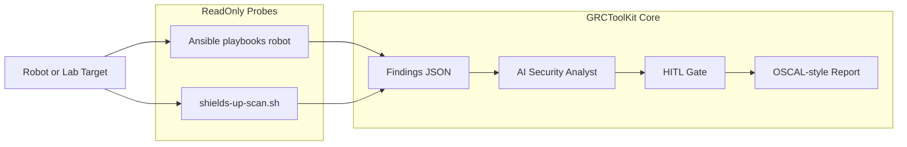

# Shields Up — Robotics Security (Vision & MVP Spec)

**Status:** Post-production planning (doc-only)  
**Branch:** `feature/shields-up-robotics`  
**Target:** GRCToolKit module after core platform production release  
**Brand:** *Shields Up* — routine security for robots that move

---

## Problem statement

Modern robots run embedded Linux, ROS 2 middleware, web/API control surfaces, and increasingly **AI planners and perception models**. They blur IT, OT, and Physical AI boundaries. Security assessments are often ad hoc, not mapped to compliance frameworks, and rarely run on a **routine schedule** with audit-ready evidence.

**Shields Up** extends GRCToolKit with read-only, scheduled security probes for robotic stacks — AI-assisted triage, Human-in-the-Loop (HITL) approval for any remediation, and OSCAL-style assessment output.

---

## Layer model

| Layer | Examples | Primary frameworks |
|-------|----------|-------------------|
| **Physical** | USB, debug ports, maintenance mode | [Robot Security Framework (RSF)](https://github.com/aliasrobotics/RSF) |
| **Network** | WiFi, VLAN, RTPS/DDS discovery (7400–7500) | RSF, NIST SC-7 |
| **OS** | Linux packages, SSH, users, containers | CIS benchmarks, SBOM/CVE scan |
| **Middleware** | ROS 2, SROS2/DDS-Security, topic ACLs | RSF, [awesome-ros-security](https://github.com/iotsrg/awesome-ros-security) |
| **Application** | Fleet dashboards, REST, rosbridge WebSocket | OWASP Web Top 10, OWASP API Top 10 |
| **AI** | LLM planners, tool use, perception pipelines | OWASP LLM Top 10 |

---

## Architecture

**Flow**

1. Scheduler or operator runs read-only probes against an authorized target.
2. Probe output normalized to JSON (finding id, layer, severity, evidence).
3. AI analyst maps findings to OWASP category + NIST 800-53 control + RSF layer.
4. **HITL:** human reviews before any remediation action on a live robot.
5. Report stored for audit trend analysis (“Shields Up status since last week”).

See [HITL-FRAMEWORK.md](HITL-FRAMEWORK.md) for guardrail tiers.

---

## Standards matrix

| Standard | Shields Up usage |
|----------|------------------|
| **RSF** | Layer-based assessment methodology (Physical → Application) |
| **OWASP Web Top 10** | Robot web dashboards, rosbridge HTTP surfaces |
| **OWASP API Top 10** | Fleet REST/gRPC APIs |
| **OWASP IoT Top 10** | Edge devices, default credentials, update mechanisms |
| **OWASP LLM Top 10** | AI planning layers, prompt injection to motion topics |
| **NIST SP 800-53 Rev. 5** | SC, AC, AU control mapping for evidence packages |
| **OSCAL** | Assessment results format (reuse GRCToolKit compliance-docs) |

---

## MVP scope (v0.1)

**In scope**

- ROS 2 + Linux lab target (Dockerized vulnerable lab acceptable)
- 10–15 read-only checks derived from awesome-ros-security checklists
- JSON findings schema + Markdown report
- AI summary of findings (reuse Gemini compliance engine patterns)
- Explicit “Shields Up / Shields Down” status per layer

**Out of scope for v0.1**

- Vendor-specific robots (Boston Dynamics, etc.)
- NVIDIA ovrtx / Isaac sim integration
- Fleet-wide schedulers at scale
- Automated remediation on production robots
- Merge to `main` before GRCToolKit production gate

---

## Reuse from GRCToolKit

| Asset | Reuse |
|-------|--------|
| `ansible/playbooks/` | Probe structure and evidence collection |
| `ai-agent/grc-compliance-engine.js` | Finding triage and summarization |
| `compliance-docs/` | Report generation |
| [HITL-FRAMEWORK.md](HITL-FRAMEWORK.md) | Mandatory human approval path |
| [SECRETS-SETUP.md](SECRETS-SETUP.md) | No keys in repo; GCP Secret Manager |

Planned probe location: `ansible/playbooks/robot/` (created in a later phase).

---

## Design principles

1. **Read-only by default** on routine scans.
2. **HITL for any change** affecting motion, safety PLCs, or production.
3. **Deterministic probes, AI interpretation** — AI does not invent scan commands without review.
4. **Authorization required** — customer must explicitly permit assessment scope.
5. **Evidence for auditors** — timestamped reports suitable for GRC workflows.

---

## Related documents

- [ROADMAP.md](ROADMAP.md) — Post-Production: Shields Up section
- [PM-TODO.md](PM-TODO.md) — P0/P1 backlog and production gate
- [OVERVIEW.md](OVERVIEW.md) — GRCToolKit platform overview (when present on branch)

---

*Planning document only. No probe implementation until P0 production gate in PM-TODO is complete.*
